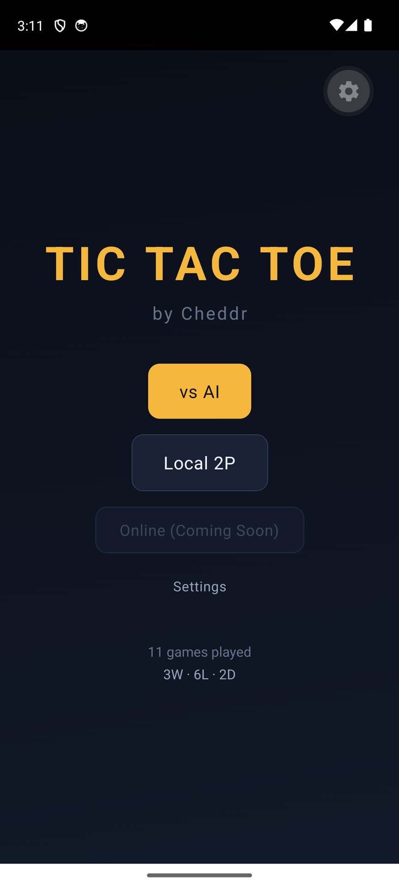

# Cheddr Tic-Tac-Toe

A polished tic-tac-toe app with three game modes — AI opponents, local 2-player, and online multiplayer via WebSocket — backed by a Go API with score tracking and Kubernetes deployment.

<p align="center">
  
</p>

## Quick Start

```bash
# Prerequisites: Node 18+
npm install
npx expo start
```

Scan the QR code with Expo Go (iOS/Android), or press `w` for web.

### Backend (optional — app works fully offline)

```bash
cd backend
go run ./cmd/server     # starts on :8080
```

The client auto-detects: uses `localhost:8080` in dev, `cheddr-api.kblab.me` in production.

## Game Modes

| Mode | Players | Backend Required | Description |
|------|---------|-----------------|-------------|
| AI | 1 | No | Three opponents: Lucky (easy), Sharp (medium), The House (unbeatable) |
| Local 2P | 2 | No | Pass-and-play on one device |
| Online | 2 | Yes | Real-time via WebSocket — create a room, share the code, play |

## Architecture

```
app/                          # Expo Router screens
  _layout.tsx                 # Root layout, fonts, splash
  index.tsx                   # Home screen (mode selection)
  difficulty.tsx              # AI opponent picker
  game.tsx                    # Game board (all modes)
  lobby.tsx                   # Online multiplayer lobby
  settings.tsx                # Preferences & stats

src/
  engine/                     # Pure game logic — ZERO React imports
    types.ts                  # Board, Player, GameResult, GameMode
    board.ts                  # Win detection, move validation
    minimax.ts                # Alpha-beta pruning AI
    ai-personalities.ts       # Lucky, Sharp, The House
    ai.ts                     # Difficulty-scaled move selection
    __tests__/                # 42 engine tests
  store/                      # Zustand state management
    game-store.ts             # Board, turns, mode, online state
    settings-store.ts         # Sound/haptics prefs (persisted)
    stats-store.ts            # Win/loss/draw by difficulty + mode
  components/
    Board/                    # Grid, cells, SVG marks, win line
    GameHeader.tsx            # AI mode — turn indicator, score bar
    LocalGameHeader.tsx       # Local 2P — player labels
    OnlineGameHeader.tsx      # Online — room code, connection status
    AIAvatar.tsx              # Opponent display with thinking animation
    Button.tsx                # Haptic-feedback button
    CelebrationOverlay.tsx    # Confetti on win
  hooks/
    useGameLoop.ts            # AI game loop
    useLocalGameLoop.ts       # Local 2P turn management
    useOnlineGame.ts          # WebSocket game lifecycle
    useHaptics.ts             # Haptic feedback
    useSound.ts               # Sound effects
  services/
    api.ts                    # REST client (fire-and-forget score sync)
    websocket.ts              # WebSocket client for online play
    ws-types.ts               # WS message type definitions
  theme/                      # Design tokens (colors, typography, spacing)

backend/                      # Go API server
  cmd/server/main.go          # Entrypoint — chi router, graceful shutdown
  internal/
    handlers/                 # REST handlers (health, scores, leaderboard)
    store/                    # SQLite persistence layer
    models/                   # Shared types
    ws/                       # WebSocket hub, client, room management
  Dockerfile                  # Multi-stage build → scratch
  Makefile                    # Local dev commands

k8s/                          # Kubernetes manifests
  deployment.yaml             # Single replica, resource limits, probes
  service.yaml                # ClusterIP service
  ingress.yaml                # Traefik ingress + cert-manager TLS
  pvc.yaml                    # Persistent volume for SQLite
  kustomization.yaml          # Kustomize overlay
  namespace.yaml              # cheddr namespace

.github/workflows/
  backend.yml                 # Backend CI/CD — test, build, push to GHCR
  android-apk.yml             # Android APK build on tag push
```

## AI Opponents

| Opponent | Difficulty | Strategy |
|----------|-----------|----------|
| Lucky | Easy | 30% optimal, 70% random — friendly and beatable |
| Sharp | Medium | 75% optimal — calculated, occasionally slips |
| The House | Hard | 100% minimax with alpha-beta pruning — unbeatable |

## Backend

### REST API

| Method | Endpoint | Description |
|--------|----------|-------------|
| GET | `/api/health` | Health check |
| GET | `/api/scores?limit=50` | List recent scores |
| POST | `/api/scores` | Submit a game result |
| GET | `/api/scores/leaderboard` | Win/loss/draw stats by opponent |

### WebSocket Protocol

Connect to `/api/ws` for real-time multiplayer.

**Client → Server**:
- `create_room` — create a new game room
- `join_room` (code) — join an existing room
- `move` (cell_index) — play a move
- `rematch` — request a rematch

**Server → Client**:
- `room_created` (code) — room created with join code
- `game_start` (mark, board, turn) — game begins, you are X or O
- `move_made` (board, turn, last_move) — opponent moved
- `game_over` (result, winner, win_line) — game ended
- `opponent_left` — opponent disconnected

### Tech Stack

Go 1.23, chi router, `modernc.org/sqlite` (pure-Go, no CGO), `nhooyr.io/websocket`.

## Online Multiplayer Flow

1. Player 1 opens **Lobby** → taps **Create Game** → gets a 4-character room code
2. Player 2 opens **Lobby** → enters the code → taps **Join**
3. Server sends `game_start` to both — assigns X (creator) and O (joiner)
4. Players take turns sending `move` messages; server validates and broadcasts `move_made`
5. On win/draw, server sends `game_over` with result and winning line
6. Either player can request a `rematch`

## Testing

```bash
npm test              # Run all 42 engine tests
npm run test:watch    # Watch mode
cd backend && go test ./...  # Backend tests
```

## Tech Stack

| Layer | Choice | Why |
|-------|--------|-----|
| Framework | Expo SDK 55 | Zero native config, QR code → play |
| Navigation | Expo Router | File-based, modern |
| Animations | Reanimated 4 + SVG | 60fps animated marks |
| Haptics | expo-haptics | Tactile feedback |
| State | Zustand + persist | Lightweight, survives restart |
| Theme | Custom dark palette | Wagering-inspired (gold accents) |
| Font | Space Grotesk | Geometric, modern |
| Testing | Vitest | Fast, pure engine tests |
| Backend | Go + chi | Lightweight, fast compilation |
| Database | SQLite (modernc.org) | Pure-Go, zero CGO, single-file DB |
| WebSocket | nhooyr.io/websocket | Production-grade, context-aware |
| Container | Docker (multi-stage) | Scratch-based, minimal image |
| Orchestration | Kubernetes | Deployment, service, ingress, PVC |
| CI/CD | GitHub Actions | Backend test + build + push to GHCR |

## Local Development

### Frontend only (AI + Local 2P — no backend needed)

```bash
npm install
npx expo start
```

Scan the QR code with Expo Go, press `w` for web, or press `a` for Android emulator.

### Frontend + Backend (all modes including Online)

```bash
# Terminal 1 — backend
cd backend
go run ./cmd/server           # starts on :8080

# Terminal 2 — frontend
npm install
npx expo start
```

The app auto-connects to `localhost:8080` in dev mode. For production it uses `cheddr-api.kblab.me`.

### Running tests

```bash
npm test                      # 42 frontend engine tests
cd backend && go test ./...   # backend tests
```

### Building Android APK locally

```bash
npx expo prebuild --platform android --clean
cd android && ./gradlew assembleDebug
# APK at android/app/build/outputs/apk/debug/app-debug.apk
```

## Branches

| Branch | Tag | Description |
|--------|-----|-------------|
| `v1.0.0` | `v1.0.0` | Original single-player AI game — 3 opponents, minimax engine, animated SVG marks, 42 tests |
| `v1.5.0` | `v1.5.0` | Adds local 2-player mode — pass-and-play, `LocalGameHeader`, `useLocalGameLoop` |
| `v2.0.0` | `v2.0.0` | Adds Go backend — chi router, SQLite, score API, fire-and-forget sync from client |
| `v2.0.5_experimental_websocket` | `v2.0.5-experimental` | **Experimental** — WebSocket online multiplayer, lobby screen, K8s deployment, backend CI/CD |
| `master` | — | Latest: docs, screenshots, Android APK CI workflow |

> **Note**: Online multiplayer (`v2.0.5_experimental_websocket`) is experimental. The button shows "Coming Soon" on the home screen. AI and Local 2P modes are fully stable on all branches from `v1.5.0` onward.

## Deployment

The backend runs on Kubernetes with the following setup:

- **Namespace**: `cheddr`
- **Image**: `ghcr.io/kblack0610/cheddr-tictactoe-api:latest` (arm64)
- **Ingress**: `cheddr-api.kblab.me` via Traefik with Let's Encrypt TLS
- **Storage**: PersistentVolumeClaim for SQLite data
- **CI/CD**: Push to `master` (backend paths) triggers test → Docker build → GHCR push
- **Manifests**: Apply with `kubectl apply -k k8s/`

## Roadmap

### Near-term
- [ ] Migrate from npm to pnpm
- [ ] Enable Online multiplayer button (remove "Coming Soon" gate)
- [ ] Extract shared game engine as standalone package (`@cheddr/engine`) — reusable across client + backend
- [ ] Add backend integration tests with real WebSocket connections

### Features
- [ ] **Behavior Tree AI** — personality-driven decision trees (Aggressive, Defensive, Chaotic, Mentor)
- [ ] **ELO Ratings** — track player skill across online matches, matchmaking by bracket
- [ ] **Replays** — record move history server-side, review past games move-by-move
- [ ] **Spectator Mode** — read-only WebSocket connections to watch live games
- [ ] **Rematch flow** — seamless rematch in online mode without returning to lobby

### Infrastructure
- [ ] Migrate Android APK CI from self-hosted macOS to EAS Build
- [ ] Add iOS build workflow
- [ ] Helm chart for backend deployment
- [ ] Observability — structured logging, Prometheus metrics, Grafana dashboard

## License

MIT
